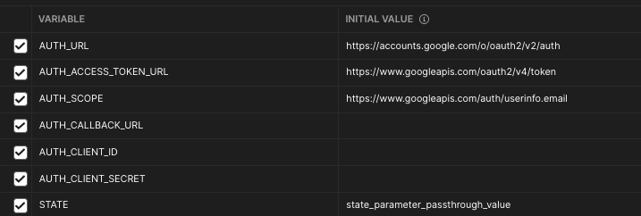
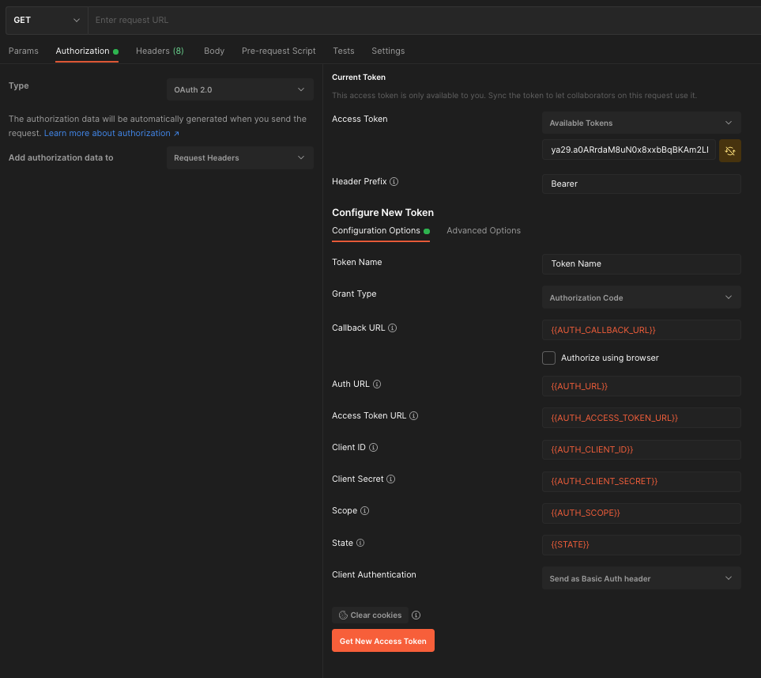
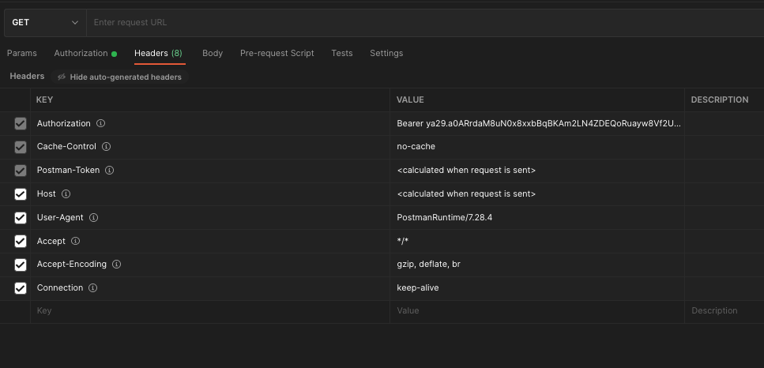

# readme

- Give it a try, hope it could help.

## Steps
1. First of all, follow the [doc](https://developers.google.com/identity/protocols/oauth2) to get the `client_id`, `client_secret` & `authorization redirect uris`
  1. GCP -> API & Services -> Credentials
  2. Create Credentials
2. Filling the postman env
  - 
3. Add a new postman api, following the image, and then to get the `Access Token`
  - 
4. Finally, you could check the Authorization in the API's header, and then you could use the `Access Token` to exec your API.
  - 

## How to verify the `Access Token`? 
- use this api
  - https://www.googleapis.com/oauth2/v3/tokeninfo?access_token=
- if fail, you would get `{"error_description": "Invalid Value"}`